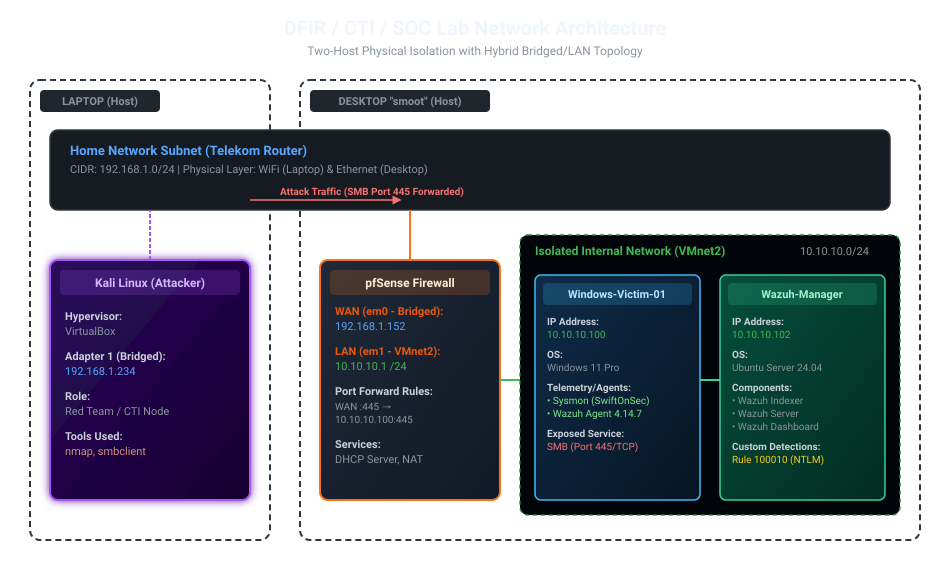

# Cybersecurity Home Lab — DFIR \& CTI Focus

**Author:** Haris Dacić — [LinkedIn](https://www.linkedin.com/in/dacicharis/) · [TryHackMe](https://tryhackme.com/p/harisD)
**Focus areas:** Digital Forensics \& Incident Response · Cyber Threat Intelligence · SOC Operations

\---

## Why this exists

Most junior security portfolios list certifications and finished courses. This
one is different: it's a **fully self-built, self-documented security
laboratory** — network segmentation, a working SIEM, live purple-team
exercises, and detection engineering — built from two consumer PCs and
documented the way a real SOC team documents its work.

The same curiosity that drives this lab led to an independent OSINT
investigation that uncovered unsecured personal data on a Montenegrin
government web portal — formally confirmed and acted on by the national Data
Protection Agency (AZLP), resulting in a compliance inspection of two state
institutions. This lab is that same instinct, applied systematically.

\---

## Architecture

Two physically separate machines, deliberately split by role — a Blue Team
system and a Red Team system — connected only through the home network, to
keep the exercises realistic and the defensive side genuinely isolated.

```
┌─────────────────────────────────────────┐          ┌──────────────────────────┐
│  DESKTOP — Blue Team / SOC              │          │  LAPTOP — Red Team / CTI │
│  (Ryzen 7 3700X · 16GB · VMware WS Pro) │          │  (i5 12th gen · VirtualBox)│
│                                         │          │                          │
│  ┌─────────────┐                        │          │  ┌────────────────────┐  │
│  │  pfSense CE  │  WAN (bridged) ─────────┼───home─┼─►│  Kali Linux        │  │
│  │  firewall/GW │                         │  network│  (attacker)         │   │
│  └──────┬───────┘                         │        │  └────────────────────┘  │
│         │ LAN 10.10.10.0/24               │        │  ┌────────────────────┐  │
│  ┌──────┴───────┐   ┌──────────────────┐  │        │  │  OpenCTI / MISP    │  │
│  │ Windows 11    │   │  Wazuh Manager   │  │       │  │  (27 svc, 3 feeds)    │
│  │ target        │──►│  SIEM/XDR        │  │       │  └────────────────────┘  │
│  │ + Sysmon      │   │  + Dashboard     │  │       │                          │
│  └───────────────┘   └──────────────────┘  │       │                          │
└─────────────────────────────────────────┘          └──────────────────────────┘
```

*(Full diagram with IPs and NAT flow in* [*`network-diagrams/`*](./network-diagrams)*)*



\---

## Stack

|Layer|Tools|
|-|-|
|Hypervisors|VMware Workstation Pro, Oracle VirtualBox|
|Network / Firewall|pfSense CE (firewall logs forwarded to Wazuh over syslog)|
|SIEM / XDR|Wazuh (Indexer + Manager + Dashboard), custom decoder, rules and CDB threat-intel lists|
|Endpoint telemetry|Sysmon (SwiftOnSecurity config)|
|Offensive tooling|Kali Linux, nmap, smbclient, enum4linux, Impacket (psexec, secretsdump)|
|CTI (in progress)|OpenCTI, MISP|
|SOAR (planned)|Shuffle|
|Infrastructure (in progress)|Docker, Kubernetes|

\---

## Repository structure

|Folder|Contents|
|-|-|
|[`dfir-writeups/`](./dfir-writeups)|Full incident-style reports for each purple team exercise — timeline, technical findings, detection analysis, root cause, recommendations|
|[`detection-rules/`](./detection-rules)|Custom Wazuh detection rules, decoders and threat-intel lists written for specific attack patterns observed in this lab
|[`network-diagrams/`](./network-diagrams)|Network topology and NAT/routing diagrams|
|[`cti-reports/`](./cti-reports)|Threat intelligence analyses (APT/malware campaigns) using OpenCTI/MISP|
|[`docs/`](./docs)|Lab build documentation and architecture notes|
|[`screenshots/`](./screenshots)|Supporting evidence referenced in writeups|

\---

## Exercises so far

|#|Title|Techniques|Status|
|-|-|-|-|
|01| [External SMB Exposure \& Detection](./dfir-writeups/01-external-smb-exposure-purple-team-exercise.md)|T1046 Network Service Scanning, T1021.002 SMB/Admin Shares, T1078 Valid Accounts|Complete|
|02| [SSH Brute-Force Attack Against Linux Target](dfir-writeups/02-ssh-bruteforce-linux-victim.md) | T1110 Brute Force, T1078 Valid Accounts | Complete |
|03| [Lateral Movement via SMB Admin Shares to SYSTEM-Level Code Execution](./dfir-writeups/03-smb-admin-shares-lateral-movement.md) | T1021.002 SMB/Admin Shares, T1569.002 Service Execution, T1059.003 Windows Command Shell | Complete |
|04| [Credential Dumping via Impacket secretsdump.py](./dfir-writeups/04-credential-dumping-impacket.md) | T1003 OS Credential Dumping, T1003.002 Security Account Manager, T1078 Valid Accounts | Complete |

More exercises are added as the lab grows — each one documented as a
standalone incident report, not just a log of commands run.

\---

## CTI Reports so far

|#|Title|Threat/Topic|Status|
|-|-|-|-|
|01| [KrustyLoader — Rust-Based Loader Linked to Ivanti Connect Secure Zero-Days](./cti-reports/01-krustyloader-ivanti-connectsecure.md) | CVE-2023-46805, CVE-2024-21887, T1190 | Complete |
|02| [ArcaneDoor — Espionage-Focused Campaign Against Perimeter Network Devices](./cti-reports/02-arcanedoor-perimeter-devices.md) | Cisco ASA/FTD, T1133 | Complete |

Built from indicators ingested into this lab's OpenCTI instance via the CIRCL
OSINT MISP feed — not a summary of an existing report, but original analysis
built from raw STIX/IOC data.

\---

## Detection rules so far

|Rule|Detects|MITRE|Type|
|-|-|-|-|
|[100010](./detection-rules/100010-external-ntlm-logon.md)|NTLM network logon from outside the lab LAN|T1550.002|Custom|
|[100011](./detection-rules/100011-psexec-lateral-movement-correlation.md)|PsExec-style lateral movement (service creation + suspicious process)|T1021.002, T1569.002, T1059.003|Correlation|
|[100012](./detection-rules/100012-credential-dumping-correlation.md)|Remote credential dumping (privileged logon + service config change)|T1003, T1003.002, T1078|Correlation|
|[100020–100023](./detection-rules/100020-100023-arcanedoor-cdb-correlation.md)|pfSense traffic from/to ArcaneDoor IPs, tiered by Talos classification: actor-controlled (level 12) and multi-tenant (level 8) (CTI Report #02)|T1133|CTI-driven|
|[5763 / 40112](./detection-rules/5763-40112-ssh-bruteforce-builtin-rules.md)|SSH brute force (Wazuh built-in rules, analyzed)|T1110|Built-in|

\---

## What's next

* \[x] Linux target with auditd, for cross-platform detection coverage
* \[x] Additional attack scenarios (lateral movement via SMB Admin Shares, credential dumping)
* \[x] Custom Wazuh rules — correlation rules 100011 and 100012, plus tiered rules 100020–100023, which match pfSense firewall logs against CDB lists built from CTI Report #02 (the first case of CTI directly feeding detection). The correlation rules were validated against live attack traffic; the CDB rules were validated with logtest, and the initial single-list version also with a live scan
* \[x] OpenCTI populated with real, public threat intel (ThreatFox, CIRCL OSINT, URLhaus feeds) — two analyst-style CTI reports published
* \[ ] SOAR automation with Shuffle

\---

## Contact

Open to junior SOC / DFIR / CTI roles, remote or relocation.
[LinkedIn](https://www.linkedin.com/in/dacicharis/) · [TryHackMe profile](https://tryhackme.com/p/harisD)
 
