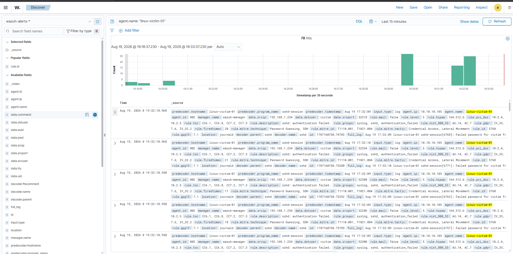

# Linux Agent Integration & Log Pipeline Verification

## Overview
Before running a full purple-team exercise against the Linux target, the Wazuh
agent installation and log ingestion pipeline on `linux-victim-01` needed to be
verified end-to-end: agent connectivity to the manager, `auth.log` collection,
and rule-based alerting on basic SSH authentication events.

This document records that verification step. The full incident-style writeup
for the SSH brute-force purple-team exercise (using `hydra`, including a
successful compromise and the resulting escalated detection) is documented
separately in
[`dfir-writeups/02-ssh-bruteforce-linux-victim.md`](../../dfir-writeups/02-ssh-bruteforce-linux-victim.md).

---

## Network Architecture & Lab Components

* **SIEM / Log Collector:** Wazuh Manager (`10.10.10.102`)
* **Edge Firewall & NAT:** pfSense (`192.168.1.152` WAN / `10.10.10.1` LAN)
* **Target / Endpoint:** Ubuntu Linux (`linux-victim-01` - `10.10.10.105`)
* **Attacker Node:** Kali Linux (`192.168.1.234`)

---

## Step 1: Agent Installation & Enrollment

1. Installed the official `wazuh-agent` package on the Ubuntu target (`linux-victim-01`).
2. Configured the agent to point to the Wazuh Manager IP (`10.10.10.102`) over port 1514/1515.
3. Verified agent service state and active connection:

```bash
sudo systemctl status wazuh-agent
```


*Figure 1: Wazuh agent running active on the target host.*

---

## Step 2: Basic Detection Test (Failed Logins Only)

To confirm the log pipeline was actually forwarding and parsing SSH events —
before committing to a full attack simulation — a simple loop of intentionally
wrong passwords was run from the Kali Linux host against the pfSense WAN IP
(`192.168.1.152:22`), forwarded to the internal target (`10.10.10.105:22`):

```bash
for i in {1..15}; do sshpass -p "wrongpassword$i" ssh victim@192.168.1.152 -o StrictHostKeyChecking=no; done
```

Every attempt was rejected by design (`Permission denied`) — no valid password
was used in this test, so no compromise occurred here. The goal was purely to
confirm that failed authentication events were being logged and reaching the
SIEM correctly.


*Figure 2: Execution of automated SSH login attempts on Kali Linux.*

---

## Step 3: Verification in Wazuh

The Wazuh `logcollector` daemon monitored the target's authentication log in
real time and forwarded events to the Wazuh Manager as expected.

1. **Event volume confirmed:** A burst of authentication events appeared on the dashboard, confirming ingestion was working.


*Figure 3: Event volume spike recorded on the Wazuh Dashboard.*

2. **Event detail confirmed:**
   * **Rule ID:** `5760` (*sshd: authentication failed*) — a basic, per-event rule, not the aggregated brute-force rule seen in the later full exercise
   * **MITRE ATT&CK Mapping:** Tactic: *Credential Access* | Technique: *Password Guessing* (`T1110.001`)
   * **Source IP (`data.srcip`):** `192.168.1.234` (Kali Linux Attacker)
   * **Target User (`data.dstuser`):** `victim`
   * **Target Agent (`agent.name`):** `linux-victim-01` (`10.10.10.105`)


*Figure 4: Expanded JSON payload confirming event fields and MITRE mapping.*

---

## Outcome

This confirmed the agent, log pipeline, and basic detection rule chain were
functioning correctly end-to-end, clearing the way for the full purple-team
exercise documented in
[`dfir-writeups/02-ssh-bruteforce-linux-victim.md`](../../dfir-writeups/02-ssh-bruteforce-linux-victim.md),
which uses a real password-cracking tool (`hydra`) against a valid credential
list and captures the escalated "failures followed by success" detection
scenario.
