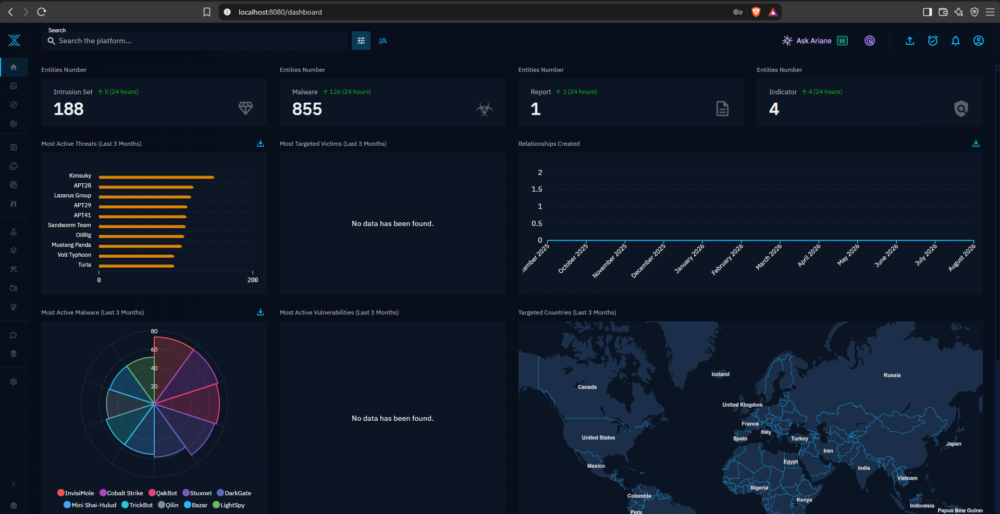
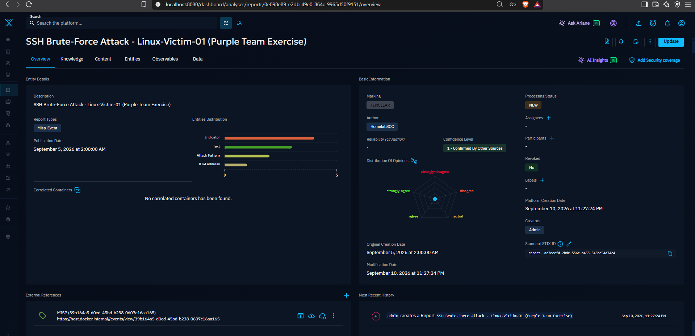
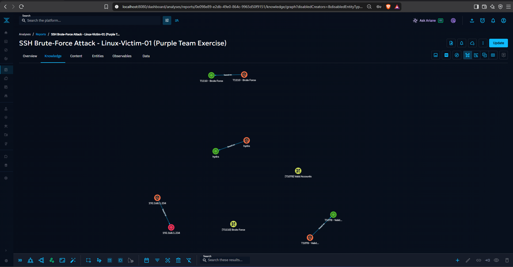
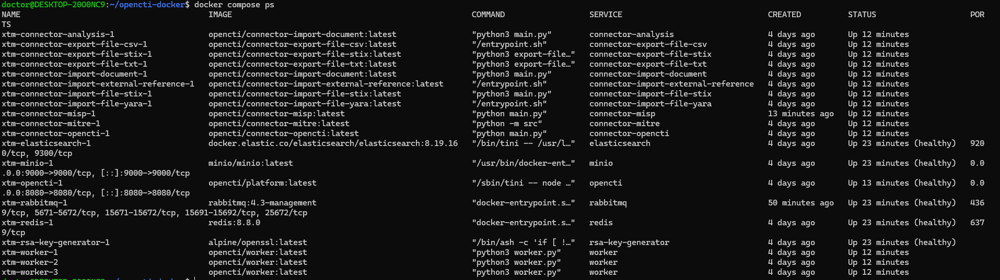

# OpenCTI Setup via Docker (Laptop / CTI Environment)

## Overview

This documents standing up **OpenCTI (Open Cyber Threat Intelligence
Platform)** as the second component of the CTI side of the lab, running via
Docker on the laptop alongside MISP (see
[`docs/misp-docker-setup/README.md`](../misp-docker-setup/README.md)).

Where MISP is used to capture and share individual threat events, OpenCTI is
used to model those events as structured **STIX2 objects** — entities like
Threat Actors, Intrusion Sets, and Indicators, connected by typed
relationships — so that intelligence from multiple sources (MISP events, the
MITRE ATT&CK catalog, and manual analysis) lives in a single connected graph
instead of isolated records.

The first real intelligence pulled into OpenCTI is, once again, the same SSH
brute-force purple-team exercise
([`dfir-writeups/02-ssh-bruteforce-linux-victim.md`](../../dfir-writeups/02-ssh-bruteforce-linux-victim.md))
— demonstrating the full pipeline: raw DFIR finding → structured MISP event →
STIX2-modeled intelligence in OpenCTI.

---

## Environment

* **Host:** Laptop (Windows 11, Intel i5-12th gen, 16GB RAM, RTX 4050)
* **Container runtime:** Docker Desktop, using the WSL2 backend
* **Linux layer:** Ubuntu (via WSL2)
* **OpenCTI deployment:** Official OpenCTI Docker Compose stack — platform,
  Elasticsearch, RabbitMQ, Redis, MinIO, 3 workers, and a set of standard
  connectors (MITRE, import/export file handlers, external reference
  enrichment), 18 services total
* **MISP:** Runs as a **separate** Docker Compose project (`~/misp-docker`),
  on the same host but its own network — see integration section below for
  how the two stacks talk to each other


*Figure 1: OpenCTI dashboard after the MITRE ATT&CK connector's initial sync — 188 Intrusion Sets and 855 Malware entities imported automatically.*

---

## Resource Tuning: `.wslconfig` Memory/CPU Limits

### Problem

By default, WSL2 has no ceiling on resource usage and will let Docker
consume whatever the host physically has. Under full OpenCTI load
(Elasticsearch indexing + all connectors active), this pushed the CPU to
**91–92°C**, measured directly in GIGABYTE Control Center — uncomfortably
close to thermal throttling territory on a laptop chassis.

### Resolution

A `.wslconfig` file (`C:\Users\<user>\.wslconfig`, Windows side, not inside
WSL itself) was used to cap both memory and CPU cores available to WSL2:

```
[wsl2]
memory=11GB
processors=8
```

This required one iteration to get right:

| Config | CPU Temp | RAM status |
|---|---|---|
| No limit | 91–92°C | N/A |
| `memory=8GB, processors=8` | 75°C | Swap full (2.0Gi/2.0Gi) — RAM too tight |
| `memory=11GB, processors=8` | **73°C** | Swap healthy (79Mi/3.0Gi) — **final config** |

**Lesson:** capping WSL2 resources is a legitimate thermal-management tool,
not just a memory-management one — throttling available RAM indirectly
throttles how hard Elasticsearch/OpenCTI can push the CPU, since less
available memory means less aggressive concurrent indexing/caching activity.
The trade-off is finding the point where temperature drops without pushing
the system into swap thrashing, which required checking both `free -h` and
CPU temperature together rather than optimizing for one in isolation.

To apply a `.wslconfig` change safely:

```powershell
@"
[wsl2]
memory=11GB
processors=8
"@ | Set-Content C:\Users\<user>\.wslconfig
```

```bash
# inside WSL, stop the stack cleanly first
cd ~/opencti-docker && docker compose stop
```

```powershell
wsl --shutdown
# wait ~15s, then restart Docker Desktop
```

---

## Known Issue: RabbitMQ Bind-Mount Desync After WSL/Docker Restart

### Symptom

After every `wsl --shutdown` / Docker Desktop restart (including the one
needed to apply the `.wslconfig` change above), the `rabbitmq` container
consistently fails to start — it doesn't appear in `docker compose ps` at
all (fully `Exited`, not restarting), and downstream, the `opencti` container
and several connectors get stuck in a `Restarting (1)` loop since they depend
on RabbitMQ being reachable.

```bash
docker compose ps -a | grep -i rabbit
# xtm-rabbitmq-1   ...   Exited (127)   ...
```

This happened three times in a row after restarts on the same day, confirming
it's a **consistent pattern on this system**, not a one-off fluke.

### Root Cause

Confirmed via `docker inspect xtm-rabbitmq-1 --format='{{json .State}}'`:
Docker Desktop's internal bind-mount cache
(`/run/desktop/mnt/host/wsl/docker-desktop-bind-mounts/...`) gets out of sync
with the actual file on disk after a WSL2/Docker Desktop restart — specifically
for the `rabbitmq.conf` bind mount. The file itself on the host side was
always confirmed intact and correctly formatted (checked with `ls -la` and
`file`); the problem is purely in Docker's internal mount cache, not the
configuration.

### Resolution

Removing and recreating just the `rabbitmq` container refreshes Docker's
internal cache without touching any other healthy service:

```bash
docker compose rm -sf rabbitmq
docker compose up -d rabbitmq
```

Within 30–60 seconds `rabbitmq` becomes healthy, and the `opencti` platform
and any stuck connectors recover on their own immediately after — no further
intervention needed.

### General lesson

If a container fails after a WSL/Docker restart specifically with a
bind-mount-related error, and the file on the host side is confirmed valid,
the fault is very likely Docker's internal mount cache rather than the actual
configuration. `docker compose rm -sf <service>` + `up -d <service>` for that
one service is a fast, low-risk fix — no need to restart the whole stack or
re-investigate the config from scratch every time it recurs.

---

## Basic STIX2 Knowledge Model — Manual Test

Before connecting any real intelligence sources, two entities were created
manually to confirm an understanding of OpenCTI's core data model before
relying on it for real data:

* **Threat Actor Group:** `APT29`
* **Intrusion Set:** `Cozy Bear Campaign 2026`
* **Relationship:** `attributed-to` (Intrusion Set → Threat Actor Group)

This distinction matters: a **Threat Actor** represents *who* is behind an
operation (the group/entity), while an **Intrusion Set** represents a
specific *campaign or cluster of observed activity* attributed to that actor.
Conflating the two — or accidentally linking to the wrong entity — is an easy
mistake, since OpenCTI's MITRE connector also imports ATT&CK groups as
**Intrusion Set** objects, meaning a search for "APT29" can return two
different entity types depending on which one is meant. This came up directly
during setup: a relationship was initially built against the wrong (MITRE
auto-imported) APT29 object, which also explained why `attributed-to` wasn't
offered as a relationship type until the correct Threat Actor Group entity
was selected instead — OpenCTI restricts relationship types based on the STIX2
type pairing of both endpoints.

---

## MISP → OpenCTI Connector Integration

### Why sequential, not parallel

MISP and OpenCTI run as **separate Docker Compose projects** on the same
laptop. Measured independently under the 11GB WSL2 memory cap:

| Stack | RAM used |
|---|---|
| OpenCTI alone (full load) | ~9.0Gi |
| MISP alone | ~2.2Gi |

Running both simultaneously would leave close to zero headroom, risking OOM
kills on the most memory-sensitive container (Elasticsearch). The two stacks
are therefore run **sequentially** — `docker compose stop` on one before
`docker compose start` on the other — rather than attempting to tune them to
coexist.

### Connector configuration

The official `connector-misp` image was added to `~/opencti-docker/docker-compose.yml`
(it isn't part of OpenCTI's default service set and had to be added manually):

```yaml
connector-misp:
  image: opencti/connector-misp:latest
  environment:
    - OPENCTI_URL=http://opencti:8080
    - OPENCTI_TOKEN=${OPENCTI_ADMIN_TOKEN}
    - CONNECTOR_ID=${CONNECTOR_MISP_ID}
    - CONNECTOR_NAME=MISP
    - CONNECTOR_SCOPE=misp
    - CONNECTOR_CONFIDENCE_LEVEL=75
    - CONNECTOR_LOG_LEVEL=info
    - MISP_URL=${MISP_URL}
    - MISP_KEY=${MISP_KEY}
    - MISP_SSL_VERIFY=${MISP_SSL_VERIFY}
    - MISP_CREATE_REPORTS=true
    - MISP_REPORT_CLASS=MISP-Event
    - MISP_IMPORT_FROM_DATE=2020-01-01
    - MISP_INTERVAL=5
  restart: always
  depends_on:
    opencti:
      condition: service_healthy
```

`.env` additions:

```
CONNECTOR_MISP_ID=<uuidgen output>
MISP_URL=https://host.docker.internal
MISP_KEY=<MISP Auth Key, stored in password manager>
MISP_SSL_VERIFY=false
```

**Cross-stack networking:** since OpenCTI and MISP are separate Compose
projects with separate Docker networks, the OpenCTI connector can't reach
MISP via an internal service name (as it does for `opencti:8080` within its
own stack). `host.docker.internal` — a Docker Desktop-provided DNS name that
resolves to the host machine — was used instead, letting the connector reach
MISP's host-published port from inside its own container. `MISP_SSL_VERIFY=false`
is needed because the local MISP instance uses a self-signed certificate.

### Result

On first run, the connector authenticated, found the existing MISP event
("SSH Brute-Force Attack - Linux-Victim-01"), and converted it into a 17-object
STIX2 bundle:

```
identity: 1, marking-definition: 1, attack-pattern: 2, ipv4-addr: 1,
indicator: 4, relationship: 4, text: 3, report: 1
```

The resulting `Report` object (type `Misp-Event`) is now visible in OpenCTI,
correctly attributed to the `HomelabSOC` organisation:


*Figure 2: The imported MISP event, now a structured OpenCTI Report — entity distribution shows Indicators, Text, Attack Patterns and an IPv4 address, all correctly attributed to HomelabSOC with a link back to the source MISP event.*

Its knowledge graph shows the imported indicators, MITRE ATT&CK techniques
(T1078, T1110), and the tool used (`hydra`) linked via `based on`
relationships:


*Figure 3: Knowledge graph of the imported MISP event — indicators (orange) linked to their corresponding MITRE techniques and tools (green) via `based on` relationships.*

**Apparent duplicate entities, explained:** the knowledge graph initially
appeared to show duplicate "T1110 - Brute Force" nodes. On inspection, these
are not duplicates — one is an `Attack Pattern` (the abstract MITRE technique,
imported by the separate MITRE connector) and the other is an `Indicator`
(the concrete artifact from this specific MISP event, tagged with that
technique). OpenCTI only allows merging entities of the same STIX2 type, which
is why no merge option appeared for these two — they represent genuinely
different concepts that happen to share a display name.

---

## Outcome


*Figure 4: Full 18-service OpenCTI stack healthy and running, including the newly added `connector-misp` service.*

* OpenCTI is running as an 18-service Docker stack, stable at 73°C under full
  load with the tuned `.wslconfig` limits.
* A recurring RabbitMQ bind-mount cache issue after WSL/Docker restarts is
  understood and has a fast, repeatable fix.
* Manual STIX2 entities (Threat Actor, Intrusion Set, `attributed-to`
  relationship) confirmed a working understanding of the core knowledge model,
  including a real mistake (wrong APT29 entity) that clarified how OpenCTI
  distinguishes Threat Actors from MITRE-imported Intrusion Sets.
* The MISP → OpenCTI connector is live, running on a 5-minute interval, and
  has successfully imported the lab's first purple-team exercise as a
  structured, graph-connected STIX2 report — completing the pipeline from raw
  DFIR finding → MISP event → OpenCTI intelligence graph.
