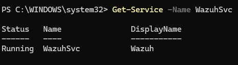
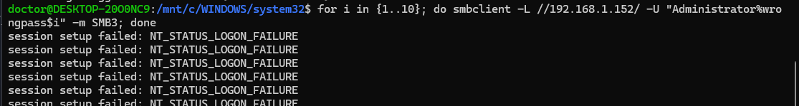
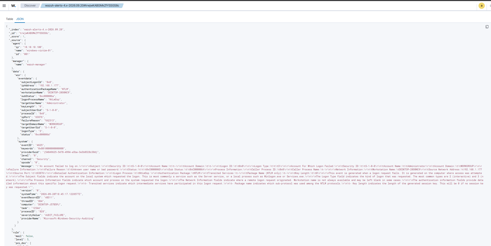

# Windows Agent Integration & Log Pipeline Verification

## Overview
Before running the purple-team exercises documented in
[`dfir-writeups/03-smb-admin-shares-lateral-movement.md`](../../dfir-writeups/03-smb-admin-shares-lateral-movement.md)
and
[`dfir-writeups/04-credential-dumping-impacket.md`](../../dfir-writeups/04-credential-dumping-impacket.md),
the Wazuh agent installation and log ingestion pipeline on `windows-victim-01`
needed to be verified end-to-end: agent connectivity to the manager,
Security/System/Sysmon event channel collection, and rule-based alerting on
basic Windows authentication events.

This document records that verification retroactively — the agent was
already installed, enrolled, and in active use across Writeups #03 and #04
before this document was written — by reading back the agent's live
configuration and running an isolated, harmless test to confirm the pipeline
end-to-end, following the same structure used for the Linux agent in
[`docs/linux-agent-integration/README.md`](../linux-agent-integration/README.md).

---

## Network Architecture & Lab Components

* **SIEM / Log Collector:** Wazuh Manager (`10.10.10.102`)
* **Edge Firewall & NAT:** pfSense (`192.168.1.152` WAN / `10.10.10.1` LAN)
* **Target / Endpoint:** Windows 11 Pro (`windows-victim-01` — hostname
  `DESKTOP-J57B5PJ`, LAN IP `10.10.10.100`)
* **Test Node (this exercise):** Laptop, WSL2 bash (`DESKTOP-20O0NC9`),
  home network IP `192.168.1.177` — used directly rather than the Kali
  attacker VM, since this is a connectivity/pipeline check rather than an
  attack simulation

---

## Step 1: Agent Configuration & Enrollment Verification

The Wazuh Windows agent was already installed and running prior to this
document, so enrollment was verified by reading the agent's live
configuration rather than repeating the install:

```powershell
Get-Content "C:\Program Files (x86)\ossec-agent\ossec.conf" | Select-String -Pattern "server|address|enrollment" -Context 1,1
Get-Service -Name WazuhSvc
```

**Findings:**

* **Manager address:** `10.10.10.102`, port `1514/tcp`
* **Enrollment:** automatic, via the agent's built-in `<enrollment>` block
  (`enabled: yes`, `agent_name: windows-victim-01`) — the agent registers
  itself with the manager's `authd` service (port 1515) on first connection
  using this name, rather than requiring a manual `manage_agents` /
  `agent-auth` step on the manager side
* **Service state:** `WazuhSvc` — **Running**
* **Configured log sources** (`<localfile>` blocks): `Application`,
  `Security` (with a set of high-volume/low-value Event IDs excluded via
  `<query>`, e.g. `4656`, `4658`, `4663`, `5145`, `5156`), `System`, and
  `Microsoft-Windows-Sysmon/Operational` — all collected as `eventchannel`


*Figure 1: `WazuhSvc` running on the target host.*

---

## Step 2: Basic Detection Test (Failed Logins Only)

To confirm the log pipeline was actually forwarding and parsing Windows
authentication events, a short series of intentionally wrong-password SMB
session attempts was run from the laptop's WSL2 bash shell against the
pfSense WAN IP (`192.168.1.152`), NAT-forwarded to the target on port 445:

```bash
for i in {1..10}; do smbclient -L //192.168.1.152/ -U "Administrator%wrongpass$i" -m SMB3; done
```

Every attempt returned `NT_STATUS_LOGON_FAILURE` — no valid password was
used, so no compromise occurred here. The goal was purely to confirm that
failed authentication events reached the SIEM correctly, the same purpose
as the equivalent SSH test in the Linux integration document.


*Figure 2: Execution of failed SMB session attempts from WSL2 bash, showing `NT_STATUS_LOGON_FAILURE` for each attempt.*

---

## Step 3: Verification in Wazuh

1. **Event detail confirmed** (Wazuh Discover, filtered on
   `agent.name: "windows-victim-01" AND data.win.system.eventID: "4625"`):

   * **Rule ID:** `60122` (*Logon Failure - Unknown user or bad password*)
   * **Rule level:** 5
   * **MITRE ATT&CK mapping (as applied by Wazuh's default rule):**
     Tactic: *Impact* | Technique: *Account Access Removal* (`T1531`)
   * **Logon type:** `3` (Network)
   * **Authentication package:** NTLM
   * **Source IP (`data.win.eventdata.ipAddress`):** `192.168.1.177`
     (laptop, via WSL2)
   * **Target account (`data.win.eventdata.targetUserName`):** `Administrator`
   * **Target agent (`agent.name`):** `windows-victim-01` (`10.10.10.100`)


*Figure 3: Expanded JSON payload in Wazuh Discover confirming event fields and rule match.*

> **Analyst note:** The default Wazuh rule for this event maps it to MITRE
> `T1531` (Account Access Removal), which is a mismatch for a simple failed
> logon — a more accurate mapping would be `T1110` (Brute Force) or
> `T1078` (Valid Accounts), as used for the equivalent Linux SSH failure
> rule (`T1110.001`) in the Linux integration document. This appears to be
> an upstream rule-mapping quirk in Wazuh's default Windows ruleset rather
> than a configuration issue on this lab's part, and is noted here rather
> than silently corrected, since no custom rule was written to override it
> for this basic connectivity check.

---

## Outcome

This confirmed the agent's enrollment, its configured log channels
(Security, System, Application, Sysmon), and the manager's default rule
processing were all functioning correctly end-to-end for basic
authentication events. This same pipeline — Security channel ingestion,
enrichment, and rule matching — is what underlies the higher-severity
correlation rules built later in the project: rule `100011` (documented in
[`detection-rules/100011-psexec-lateral-movement-correlation.md`](../../detection-rules/100011-psexec-lateral-movement-correlation.md))
and rule `100012` (documented in
[`detection-rules/100012-credential-dumping-correlation.md`](../../detection-rules/100012-credential-dumping-correlation.md)),
both of which correlate multiple Security-channel events collected through
this same `windows-victim-01` agent configuration.
